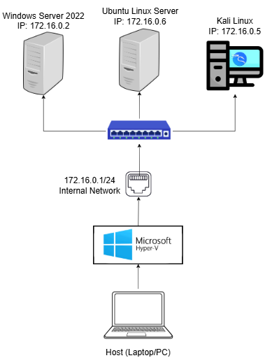

# SOC-Homelab

## Table of Contents
- [Project Overview](#project-overview)
- [Homelab Architecture](#homelab-architecture)
- [Defensive Stack & Telemetry](#defensive-stack--telemetry)
- [Attack & Detection Scenarios](#attack--detection-scenarios)
- [Vulnerability Scan with Nessus](#vulnerability-scanning-with-nessus)
- [Lessons Learned](#lessons-learned)

---

## Project Overview

### Description
This homelab project demonstrates the design and implementation of an SOC environment ...

### Key Objectives
- 

---

## Homelab Architecture

### Network Diagram: 

**Private Network Configuration:**
- **Subnet:** 172.16.0.0/24
- **Windows Server IP:** 172.16.0.2
- **Ubuntu Server IP:** 172.16.0.6
- **Kali Linux IP:** 172.16.0.5
- **Internal Switch IP:** 172.16.0.1
- **Domain Name:** HELPLAB.local

### Hardware & Virtualization Specifications

#### Host Machine:
- **RAM:** 16 GB
- **CPU:** 4 cores / 8 threads
- **Storage:** 1 TB SSD
- **Hypervisor:** Microsoft Hyper-V
- **Operating System:** Windows 11 Pro

#### Virtualization Specs:
| Virtual Machine | Role | OS | vCPU | RAM | Storage |
| --- | --- | --- | --- | --- |---|
| Windows Server | Victim / Domain Controller | Windows Server 2022 | 4 cores | 3.5 GB | 60 GB |
| Ubuntu Linux Server | SIEM / Network IDS | Ubuntu (Wazuh) | 2 cores | 2.5 GB | 40 GB |
| Kali Linux | Attacker | Kali Linux | 2 cores | 2 GB | 40 GB |

[Click here for more details on Homelab Installation and Configuration](lab_setup/lab_setup.md)

---

## Defensive Stack & Telemetry

| Component | Technology | Purpose |
| --- | --- | --- |
| **Endpoint Agent** | Wazuh Agent | Log collection and active response |
| **Endpoint Monitor** | Sysmon | Detailed windows activity logging |
| **Network Monitor** | Suricata | Network activity logging |
| **Central Manager** | Wazuh Manager | Enriches data, matches rules, and triggers alerts |
| **Database** | Wazuh Indexer | Stores and indexes the data |
| **Visualizer** | Wazuh Dashboard | Provides the GUI for analysis and reporting |

### Description

The architecture of this stack follows a "defense-in-depth" philosophy by combining host-level telemetry with network-level inspection.

#### 1. Data Aggregation & SIEM Objectives

The **Wazuh Manager** serves as the central nervous system of the stack. It aggregates data from two primary streams:

* **Host Telemetry:** Pushed from the Wazuh Agents installed on endpoints.
* **Network Telemetry:** Ingested from Suricata sensors (via wazuh agent reading the `eve.json` log file).

The primary goal of this SIEM and Log Management strategy is to provide a "single pane of glass" for security operations. By centralizing logs, we may easily link a suspicious network connection (from Suricata) to a specific malicious process (from Sysmon), for example.

#### 2. Endpoint Logging: Wazuh & Sysmon

On the Windows Server, the Wazuh agent acts as the primary collector, but it relies on Sysmon to provide extra details necessary for threat hunting.

* **Wazuh Agent:** Collects standard Windows Event Logs, specifically the **System**, **Application**, and **Security** channels. These provide visibility into account logins, service changes, and policy modifications.
* **Sysmon (with SwiftOnSecurity Configuration):** While standard logs show that a process started, Sysmon provides the *context*. Using the SwiftOnSecurity configuration, the system focuses on high-signal events while filtering out noise. Key events collected include:
    * **Event ID 1 (Process Creation):** Logs nearly all process launches but excludes many standard Windows and Microsoft processes (e.g., `svchost.exe`, `wermgr.exe`, and `.NET` tasks) to reduce volume. 
    * **Event ID 11 (File Creation Time):** Monitors for "Timestomping" (retroactively changing file creation times).
    * **Event ID 3 (Network Connections):** Takes a conservative approach, logging only extremely high-signal events.

#### 3. Network Visibility: Suricata Integration

Suricata provides network-level detection through Deep Packet Inspection (DPI) and signature matching. A Wazuh agent monitors Suricata’s `eve.json` output and forwards data to the Wazuh Manager. 

To maintain high-signal monitoring and system performance, the dashboard is configured to visualize only Suricata alerts (event_type: alert), allowing for rapid correlation between network threats and endpoint activity.

---

## Attack & Detection Scenarios

### SMB Brute Force Attack

**Objective:** Attempt to break into the Windows Server (172.16.0.2) file-sharing service using the "Administrator" username and a list of common passwords. 

**MITRE ATT&CK Mapping:**
- Tactic: Credential Access (TA0006)
- Technique: Brute Force (T1110)
    - Sub-technique: Password Guessing (001)

[Click here to view detailed incident report](brute_force_scenario.md)

### SMB Enumeration

**Objective:** 

**MITRE ATT&CK Mapping:**
- Tactic: 
- Technique: 
    - Sub-technique: 

[Click here to view detailed incident report](smb_enumeration_scenario.md)

### Malware Execution

**Objective:** 

**MITRE ATT&CK Mapping:**
- Tactic: 
- Technique: 
    - Sub-technique: 

[Click here to view detailed incident report](malware_execution_scenario.md)

---

## Vulnerability Scanning with Nessus

NIST CSF Function: Identify (ID)

Category: ID.RA — Risk Assessment 
- ID.RA-01: Vulnerabilities in assets are identified, validated, and recorded
     - Mapping: Used vulnerability management technology (Nessus) to identify unpatched and misconfigured software.

### Scan Summary

A basic network scan was performed on the Domain Controller (Windows Server 2022). The most significant findings relate to missing cumulative update patches, which could allow a multitude of attacks from an attacker already within the private network; including remote code execution, denial of service, privilege escalation, and more. While the severity of these vulnerabilities is critical, the current Risk is rated as **Medium** due to the host's placement within a segmented private lab environment, which limits external exposure.

[Click here to view full vulnerability report](vulnerability_findings/DC_vuln_report.md)

---

## Lessons Learned

### Technical Skills Gained
- 

### Challenges Encountered
- Installing additional software on VMs in a private network
- Designing Homelab with 16 GB RAM constraints
- Struggled to configure Suricata to feed logs into Wazuh SIEM

### Future Improvements
- Boosting VM performance with additional RAM
- Integrating AD homelab with SOC homelab completely (adding client workstation VMs)
- Adding a DVWA linux server for simulating SQL injection attacks
- Adding a dedicated NIDS linux server
- Upgrading from Wazuh to Splunk or ELK for better threat detection/analysis
