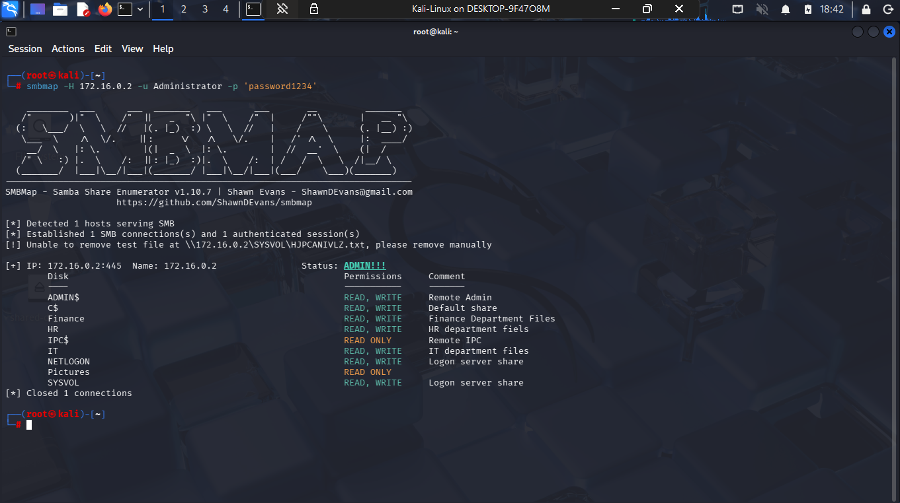
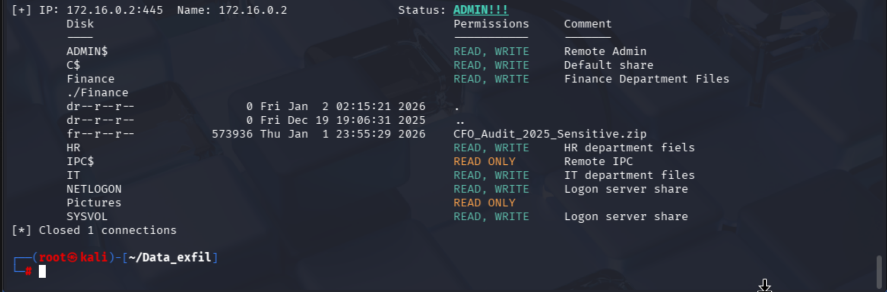
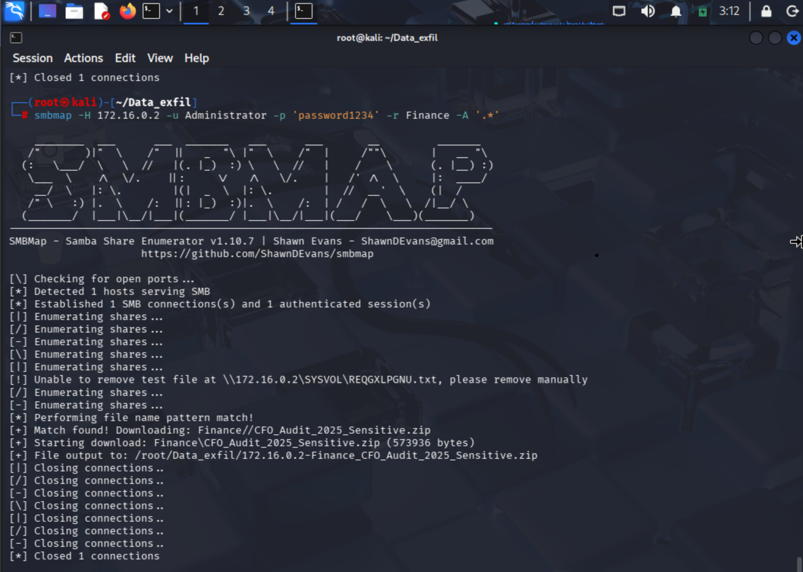
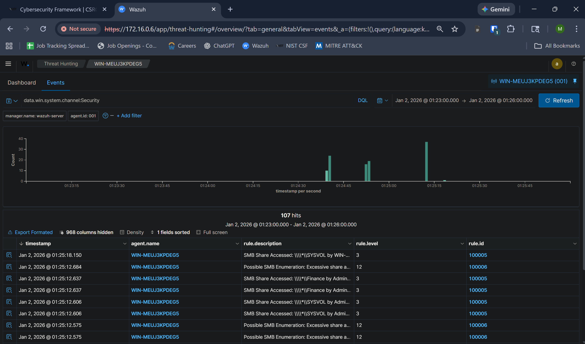
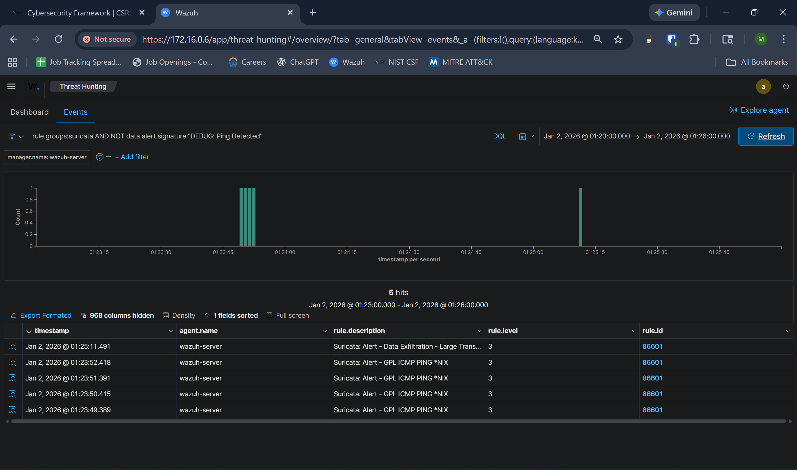
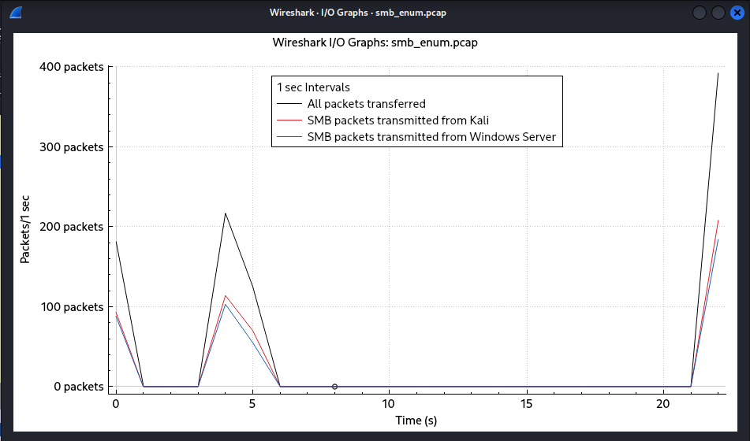
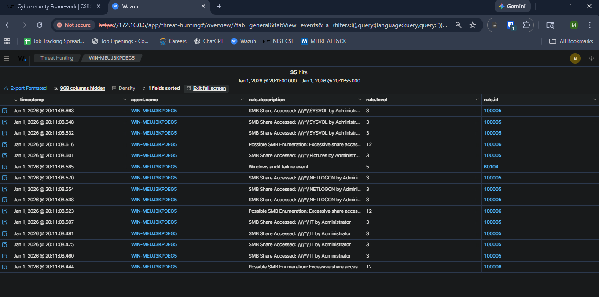

# SMB Enumeration & Data Exfiltration

## Table of Contents
- [Scenario Overiew](#i-scenario-overview)
- [Attack Phase](#ii-attack-phase)
- [Detection Phase](#iii-detection-phase)
- [Incident Response Phase](#iv-incident-response-phase)
- [Corrective Measures Phase](#v-corrective-measures-phase)

## I. Scenario Overview:

**Objective:** Using valid SMB credentials, enumerate network shares hosted on the Windows Server (172.16.0.2), identify sensitive or accessible data, and exfiltrate selected files to an unauthorized system within the segmented private network.

**MITRE ATT&CK Mapping:**
- Tactics: 
    - Discovery (TA0007)
    - Exfiltration (TA0010)
- Techniques: 
    - Network Share Discovery (T1135)
    - Exfiltration Over Alternative Protocol (T1048)

## II. Attack Phase:

### Step 1: Ensure SMB service is open on target (172.16.0.2)
```bash
# Ensure target is reachable
ping -c 4 172.16.0.2

# Check if file-sharing service (445) is open
nmap -p 445 172.16.0.2
```

### Step 2: Enumerate network shares using `smbmap`
```bash
smbmap -H 172.16.0.2 -u Administrator -p 'password1234'  
# - -H: Specify target host IP
# - -u: Specify account username
# - -p: Specify account password 
```


### Step 3: View contents of Finance share
```bash
smbmap -H 172.16.0.2 -u Administrator -p 'password1234' -r 'Finance'
# - -r: Specify share to open
```


### Step 4: Locally download all files stored in Finance share
```bash
smbmap -H 172.16.0.2 -u Administrator -p 'password1234' -r Finance -A '.*'
# - -A: Specify which files to download
```


## III. Detection Phase:

### NIST CSF Function: Detect (DE)

Category: DE.CM — Continuous Monitoring
- DE.CM-09: Computing hardware and software, runtime environments, and their data are monitored to find potentially adverse events
     - Mapping: Monitor file sharing services to detect enumeration and exfiltration.

### Step 1: Analyze Windows Security Events

In Wazuh Dashboard ...
- Filter for `agent.name: WIN-MEUJ3KPDEG5` (Windows Server agent)
- Filter for `data.win.system.channel: Security` (Security Event Logs)
- Select Timeslot: `Jan 2, 2026 @ 01:23:00.000` -> `Jan 2, 2026 @ 01:26:00.000`




### Security Event summary:
| rule.description | hit count | rule.id |data.win.eventdata.ipAddress | agent.ip |
| --- | --- | --- | --- | --- |
| SMB Share Accessed: ... by Administrator | 79 | 100005 | 172.16.0.5 | 172.16.0.2 |
| Possible SMB Enumeration: ... | 24 |  100006 |172.16.0.5 | 172.16.0.2 |
| Windows audit failure event | 3 | 60104 | 172.16.0.5 | 172.16.0.2 |

We observe that some machine (172.16.0.5) logged in as Administrator accessed a large number of network shares across different departments within the span of 3 minutes triggering multiple "Possible SMB Enumeration" alerts.

### Step 2: Analyze Suricata Logs
In Wazuh Dashboard ...
- Filter for `rule.groups:suricata` (network logs)
- Select Timeslot: `Jan 2, 2026 @ 01:23:00.000` -> `Jan 2, 2026 @ 01:26:00.000`



### Network log summary:
| rule.description | hit count | data.src_ip | data.dest_ip |
| --- | --- | --- | --- |
| Suricata: Alert - GPL ICMP PING *NIX | 4 | 172.16.0.5 | 172.16.0.2 |
| Suricata: Alert - Data Exfiltration - Large Transfer from SMB Port  | 1 | 172.16.0.5 | 172.16.0.2 |

We observe that some machine (172.16.0.5) sent a ping request to the primary domain controller before retrieving a sizeable amount data via the SMB Port. For the data exfiltration alert to be triggered, the machine's IP must appear as an "external" IP not being registered under the Suricata `HOME_NET`, along with having transferred greater than 50 KB. Combined with the fact that this detection was triggered by the same device/account having triggered an SMB enumeration alert shortly before, a data exfiltration attempt appears likely and warrants further investigation.

### Step 3: Network Traffic Analysis (Wireshark)

Capture packets during attack
(In Kali terminal):
```bash
# Start capture before attack
sudo tcpdump -i eth0 -w smb_enum.pcap host 172.16.0.2 and port 445

# Run attack, then stop capture (Ctrl + C)
```
Analyze network traffic in Wireshark: `wireshark smb_enum.pcap`

Display I/O graph for number of packets transferred between Kali and Windows Server:

In the graph above we observe three major spikes. Observing the first two spikes we see a large mutual exchange of SMB packets between Kali and the Windows Server, aligning temporally with multiple SMB enumeration alerts. 

Display I/O graph for number of Bytes transferred between Kali and Windows Server:

Near the end of the packet capture above, we observe a major spike in data transmitted from the Windows Server to the Kali machine, aligning temporally with the firing of the data exfiltration alert.

Step 1: Analyze first traffic spike for share enumeration speed
- Apply display filter: `frame.number < 182`
- Navigate to Statistics > Conversations > TCP tab > Check 'limit to display filter' option
- Analysis shows the Kali machine transmitted 80 packets and received 79 from the Windows Server over 0.1924 seconds, averaging approximately 4 SMB requests every 10 milliseconds.

Step 2: Analyze second traffic spike for share enumeration speed
- Apply display filter: `frame.number < 524 and frame.number > 181`
- Navigate to Statistics > Conversations > TCP tab > Check 'limit to display filter' option
- Analysis shows the Kali machine transmitted 80 packets and received 79 from the Windows Server over 0.1763 seconds, averaging approximately 4.5 SMB requests every 10 milliseconds.

Step 3: Analyze third traffic spike for amount of data transferred
- Apply display filter: `frame.number > 523`
- Navigate to Statistics > Conversations > TCP tab > Check 'limit to display filter' option
- Only focus on conversations where bytes transferred from server exceeds 50 KB since that is our exfil detection threshold.
- Analysis shows the Windows server transferred 581 KB within .2438 seconds to the Kali machine. This confirms that a large transfer of data did indeed take place.

Deep Packet Analysis Summary:
Using our SIEM alerts as context, our wireshark analysis confirms that a large number of network shares were enumerated in a short period of time (much too fast for a human) followed by the exfiltration of a large amount of data (>50 KB) from the Windows Server.

## IV. Incident Response Phase:

### NIST CSF Function: Response (RS)

Category: RS.MI — Incident Mitigation 
- DE.MI-01: Incidents are contained
    - Mapping: Temporarily lock administrator account
    - Mapping: Block attacker source IP using host-based firewall rules
- DE.MI-02: Incidents are eradicated 
    - Mapping: Reset Administrator Account Password
    - Mapping: Terminate active SMB sessions from attacker

Category: RS.AN — Analysis
- RS.AN-03: Analysis is performed to establish what has taken place during an incident and the root cause of the incident
    - Mapping: Review file server audit logs to identify accessed files and shares

Category: RS.CO — Communications
- RS.CO-03: Information is shared with designated internal and external stakeholders
    - Mapping: Escalate incident to affected business units (Finance/IT leadership)

### Remediation Steps:

Step 1: Temporarily Lock Administrator Account

Step 2: Block attacker source IP using host-based firewall rules on the Domain Controller

Step 3: Terminate active SMB sessions from attacker

Step 4: Reset Administrator Account Password

Step 5: Investigate File Server Audit logs (if detailed file access auditing is enabled) to determine:
- Which shares were accessed?
- Which specific files were read, copied, or modified?
- Total volume of data accessed
- Timeline of attacker activity

Step 6: Notify Stakeholders
- Provide technical report summary to IT leadership
- Notify Finance department that financial data was accessed

## V. Corrective Measures Phase:

### NIST CSF Function: Protect (PR)

Category: PR.AA — Identity Management, Authentication, and Access Control
- PR.AA-03: Users, services, and hardware are authenticated
     - Mapping: Implement Password Complexity Policy

Category: PR.PS — Platform Security
- PR.PS-01: Configuration management practices are established and applied
     - Mapping: Implement Account Lockout Policy

Category: PR.DS — Data are managed consistent with the organization's risk strategy to protect the confidentiality, integrity, and availability of information
- PR.DS.02: The confidentiality, integrity, and availability of data-in-transit are protected
    - Mapping: Restrict SMB access to authorized domain-joined devices only.
- PR.DS-05: Protections against data leaks are implemented
    - Mapping: Implement file screening and detailed file access auditing.

### Preventative Measures:

Step 1: Implement Account Lockout Policy
- Account lockout threshold: 5 invalid logon attempts
- Account lockout duration: 30 minutes

Step 2: Implement Password Complexity Policy
- Minimum password length: 12 characters
- Default Password complexity requirements: Enabled

Step 3: Implement 'SMB Access - Domain Joined Only' Policy
- Create a custom firewall rule targeting port 445 (SMB) that enforces the computer account to authenticate via Kerberos V5. This ensures only domain-joined devices can access SMB service.

Step 4: Implement Data Loss Prevention Controls
- Enable detailed file access auditing on sensitive shares
- Implement file screening to block .zip, .rar, .7z in unauthorized locations