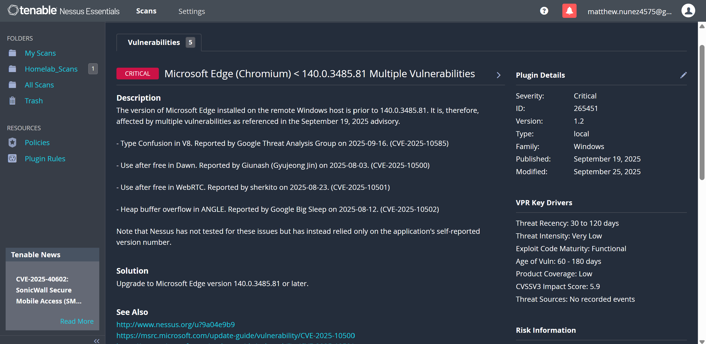
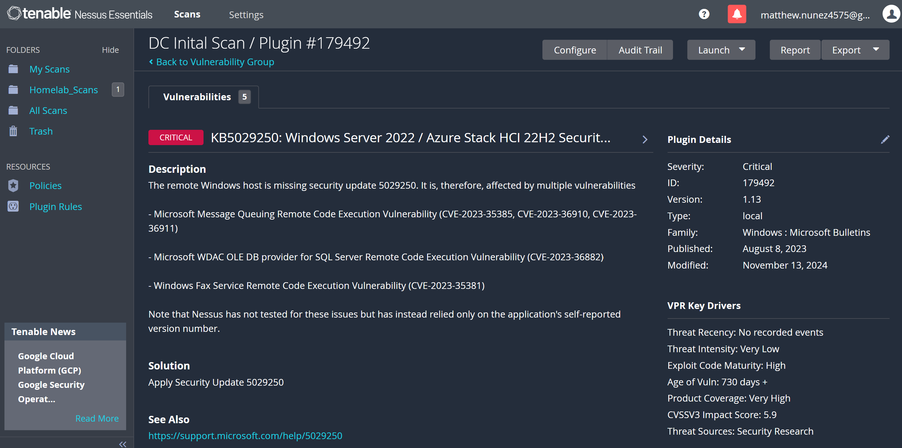
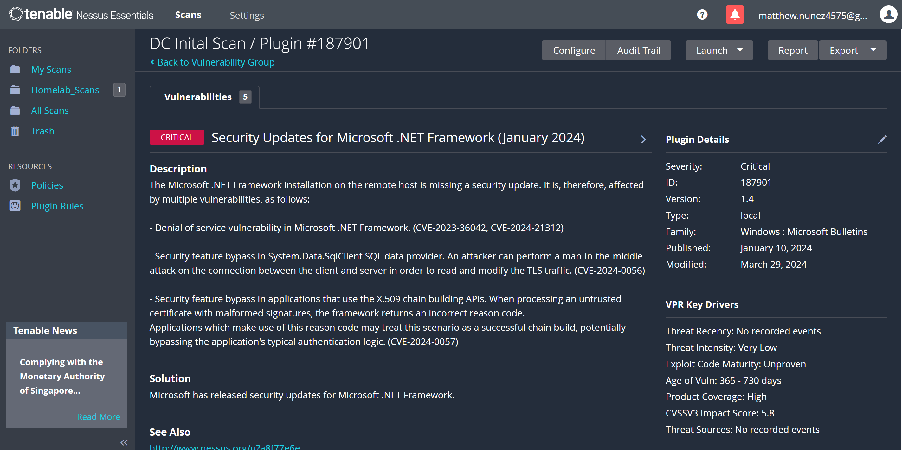
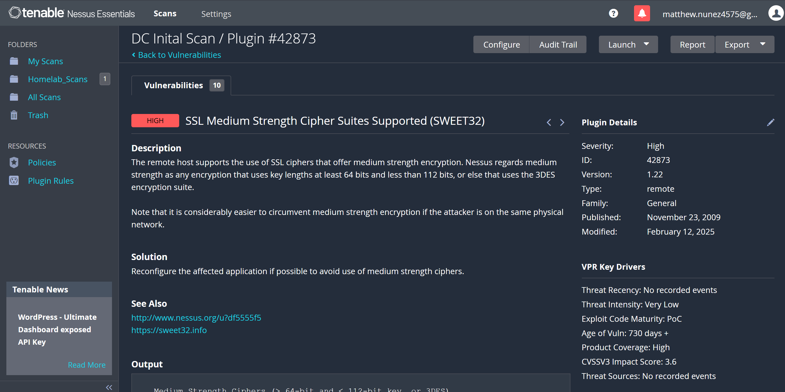
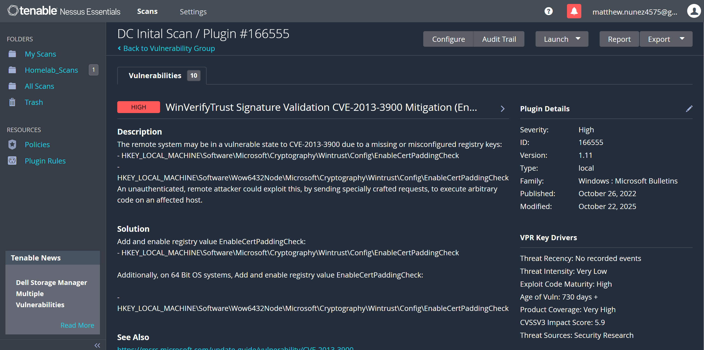
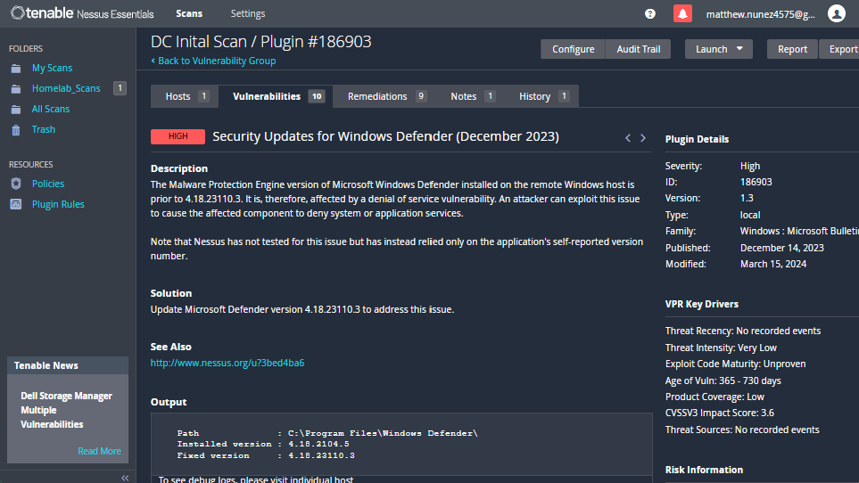
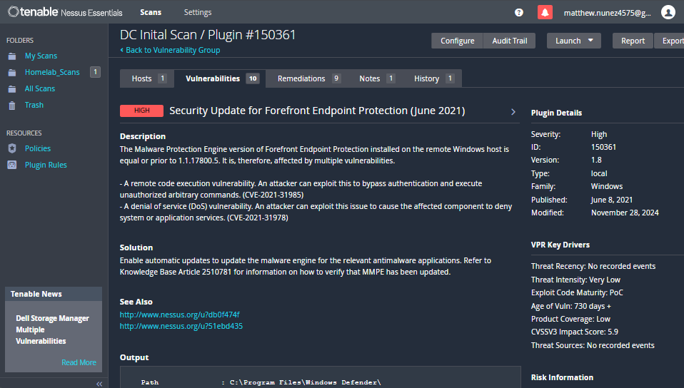
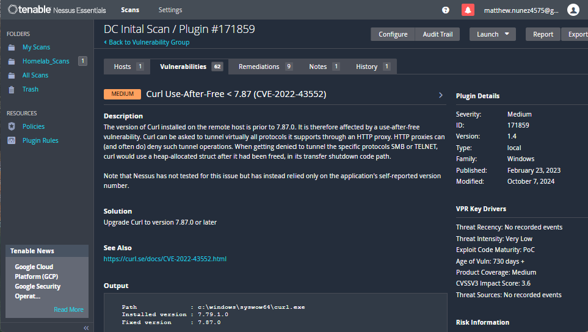

# Vulnerability Assessment Report: Domain Controller

**Target:** 172.16.0.2 (Windows Server 2022)

**Date:** 12/26/2025

**Assessor:** Matthew Nunez

**Severity Scale:** Critical

---

## 1. Executive Summary

**Example:** A basic network scan was performed on the Primary Domain Controller (). The scan identified [X] total vulnerabilities. The most significant findings relate to [e.g., SMB Signing or Outdated Protocols], which could allow an attacker to perform Man-in-the-Middle attacks. The overall risk posture is **Medium**.

---

## 2. Scope & Methodology

* **Scan Tool:** Nessus Essentials 10.11.1
* **Scan Type:** Basic Network Scan (Credentialed)
* **Target Host:** `WIN-MEUJ3KPDEG5` (172.16.0.2)
* **Network Segment:** Lab Internal (172.16.0.0/24)

---

## 3. Vulnerability Breakdown

### Microsoft Edge (Missing "Cumulative Update" Patches)

* **Severity:** Critical
* **Famliy:** Windows
* **Total Vulnerability Count:** 1354
* **Description:** The version of Microsoft Edge installed is a few updates behind and is exposed to numerous vulnerabilities including Use-after-free, heap buffer overflow, etc.
* **Evidence:** 
* **Remediation:** Updating Microsoft Edge to a secure version (142.0.3595.90 or later) will likely fix all related vulnerabilites.

### Missing Security Updates for Windows Server 2022 / Azure Stack HCI 22H2

* **Severity:** Critical
* **Famliy:** Windows: Microsoft Bulletin
* **Total Vulnerability Count:** 61
* **Description:** The Windows Server is many security updates behind exposing it to a multitude of vulnerabilities including heap buffer overflow, remote code execution, elevation of privilege, etc.
* **Evidence:** 
* **Remediation:** Updating Windows Server 2022 to the most recent security update (KB5068787 or later) will likely resolve all vulnerabilities at once.

### Missing Security Updates for Microsoft .NET Framework

* **Severity:** Critical
* **Famliy:** Windows
* **Total Vulnerability Count:** 33
* **Description:** The Microsoft .NET Framework installation on the domain controller is missing security updates exposing it to multiple vulnerabilities including Denial of service, man-in-the-middle, remote code execution, etc.
* **Evidence:** 
* **Remediation:** Updating Microsoft .NET Framework to the most recent security update (January 2025) will likely resolve both vulnerabilities.

### SSL Medium Strength Cipher Suites Supported (SWEET32)

* **Severity:** High
* **Famliy:** General
* **Nessus Plugin ID:** 42873 
* **Port / Protocol:** 3389 / tcp / msrdp
* **Description:** Domain controller supports the use of SSL ciphers that offer medium strength encryption (less than 112 bit key length). Medium strength encryption may pose risks such as susceptibility to sophisticated brute force attacks or compliance expiration. 
* **Evidence:** 
* **Remediation:** Reconfigure domain controller to avoid using medium ciphers if possible.

### WinVerifyTrust Signature Validation CVE-2013-3900 Mitigation (EnableCertPaddingCheck)

* **Severity:** High
* **Famliy:** Windows: Microsoft Bulletin
* **Nessus Plugin ID:** 166555 
* **Port / Protocol:** 445 / tcp / cifs
* **Description:** A remote code execution vulnerability exists in the way the WinVerifyTrust function handles signature verification for portable execution files. This vulnerability allows an attacker to append malicious code to the padding of a signed file.
* **Evidence:** 
* **Remediation:** To remediate the "padding check" must be manually enabled via the windows registry.

### Security Updates for Windows Defender

* **Severity:** High
* **Famliy:** Windows: Microsoft Bulletin
* **Total Vulnerability Count:** 17
* **Description:** The Malware Protection Engine of Microsoft Windows Defender installed is a few security updates behind exposing the system to a multitude of vulnerabilities including denial of service, privilege escalation, etc.
* **Evidence:** 
* **Remediation:** Updating Microsoft Defender to platform version 4.18.24010.12 or later to resolve this issue.

### Security Update for Forefront Endpoint Protection

* **Severity:** High
* **Famliy:** Windows
* **Total Vulnerability Count:** 3
* **Description:** The Malware Protection Engine of Forefront Endpoint Protection is equal or prior to 1.1.17700.4 exposing it to multiple vulnerabilities including remote code execution, denial of service, etc.
* **Evidence:** 
* **Remediation:** Enable automatic updates to update the malware engine for the relevant antimalware applications and verify that MMPE has been updated.

### Curl Use-After-Free < 7.87 (CVE-2022-43552)

* **Severity:** Medium
* **Famliy:** Windows
* **Nessus Plugin ID:** 171859 
* **Port / Protocol:** 445 / tcp / cifs
* **Description:** Version of Curl installed is 7.79.1.0 making it susceptible to the use-after-free vulnerability. Such a vulnerability can lead to remote code execution, information leaks, and system crashes.
* **Evidence:** 
* **Remediation:** Updating Curl to version 7.87.0 or later.

---

## 4. Port & Service Summary

| Port | Service | Status | Justification / Business Need |
| --- | --- | --- | --- |
| **53** | DNS | Open | Essential for Active Directory domain controller discovery and name resolution. |
| **67/68** | DHCP | Open | Manages automatic IP address assignment for clients on the network. |
| **88** | Kerberos | Open | Primary authentication protocol for Active Directory users and services. |
| **135** | RPC Endpoint Mapper | Open | Required for AD Replication, Group Policy processing, and Remote Management. |
| **137-139** | NetBIOS Services | Open | Supports legacy name resolution and older file-sharing protocols. |
| **389 / 636** | LDAP / LDAPS | Open | Used for directory service queries; 636 provides secure, encrypted communication. |
| **445** | SMB over IP | Open | Facilitates file sharing and the distribution of Group Policy Objects (GPOs). |
| **464** | Kerberos Password | Open | Allows users to change or reset passwords across the domain. |
| **593** | RPC over HTTP | Open | Enables RPC Endpoint Mapping over HTTP/HTTPS for improved firewall traversal. |
| **2535** | MADCAP | Open | Assigns multicast IP addresses (typically part of DHCP Server role). |
| **3268 / 3269** | Global Catalog | Open | Forest-wide searches and Universal Group membership verification. |
| **3389** | RDP | Open | Facilitates remote administrative access to the server. |
| **5353** | mDNS | Open | Multicast DNS; used for local device discovery |
| **5355** | LLMNR | Open | Link-Local Multicast Name Resolution; legacy name resolution for local subnets. |
| **5985** | WinRM (HTTP) | Open | Windows Remote Management; used for PowerShell remoting and automation. |
| **9389** | AD Web Services | Open | Provides a management interface for AD PowerShell and Administrative Center. |
| **47001** | WinRM Management | Open | Used by the WinRM service for listening to management requests. |
| **49664 - 49700** | RPC Dynamic Ports | Open | High-range ports used dynamically by AD for replication and client requests. |

---

## 5. Security Recommendations

1. **Disable Legacy Protocols:** If LLMNR or NetBIOS showed up in your scan, recommend disabling them.
2. **Patch Management:** List any missing KB (Knowledge Base) updates Nessus found.
3. **Hardening:** Suggest implementing a "Tiered Administrative Model" or disabling RDP if not strictly necessary.

---

## Conclusion & Post-Remediation Status

The initial assessment of the Domain Controller identified a significant attack surface, primarily due to [outdated patch levels/legacy configurations]. Following the identification of 65 Critical and 186 High vulnerabilities, a remediation phase was initiated.

Key Actions Taken:
- Applied Cumulative Security Updates (fixing X vulnerabilities).
- Hardened the Windows Registry against CVE-2013-3900.
- Disabled insecure legacy protocols (SMBv1).

Final Posture: A follow-up verification scan confirmed a [X]% reduction in Critical findings. While some "Informational" risks remain, the primary vectors for Remote Code Execution have been mitigated. The system is now considered [Stable/Hardened] for production use.